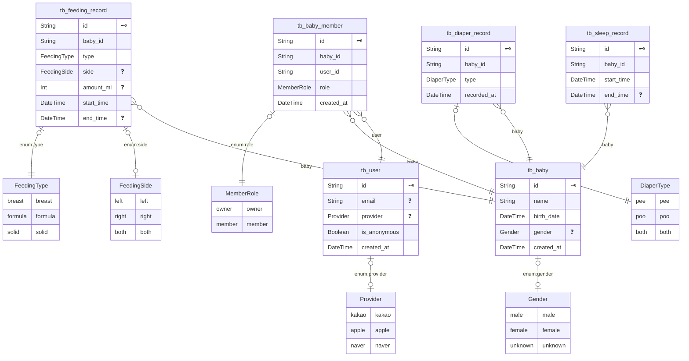

```mermaid
erDiagram

        Provider {
            kakao kakao
apple apple
naver naver
        }
    


        Gender {
            male male
female female
unknown unknown
        }
    


        MemberRole {
            owner owner
member member
        }
    


        FeedingType {
            breast breast
formula formula
solid solid
        }
    


        FeedingSide {
            left left
right right
both both
        }
    


        DiaperType {
            pee pee
poo poo
both both
        }
    
  "tb_user" {
    String id "🗝️"
    String email "❓"
    Provider provider "❓"
    Boolean is_anonymous 
    DateTime created_at 
    }
  

  "tb_baby" {
    String id "🗝️"
    String name 
    DateTime birth_date 
    Gender gender "❓"
    DateTime created_at 
    }
  

  "tb_baby_member" {
    String id "🗝️"
    String baby_id 
    String user_id 
    MemberRole role 
    DateTime created_at 
    }
  

  "tb_feeding_record" {
    String id "🗝️"
    String baby_id 
    FeedingType type 
    FeedingSide side "❓"
    Int amount_ml "❓"
    DateTime start_time 
    DateTime end_time "❓"
    }
  

  "tb_sleep_record" {
    String id "🗝️"
    String baby_id 
    DateTime start_time 
    DateTime end_time "❓"
    }
  

  "tb_diaper_record" {
    String id "🗝️"
    String baby_id 
    DiaperType type 
    DateTime recorded_at 
    }
  
    "tb_user" |o--|o "Provider" : "enum:provider"
    "tb_baby" |o--|o "Gender" : "enum:gender"
    "tb_baby_member" |o--|| "MemberRole" : "enum:role"
    "tb_baby_member" }o--|| tb_baby : "baby"
    "tb_baby_member" }o--|| tb_user : "user"
    "tb_feeding_record" |o--|| "FeedingType" : "enum:type"
    "tb_feeding_record" |o--|o "FeedingSide" : "enum:side"
    "tb_feeding_record" }o--|| tb_baby : "baby"
    "tb_sleep_record" }o--|| tb_baby : "baby"
    "tb_diaper_record" |o--|| "DiaperType" : "enum:type"
    "tb_diaper_record" }o--|| tb_baby : "baby"
```
